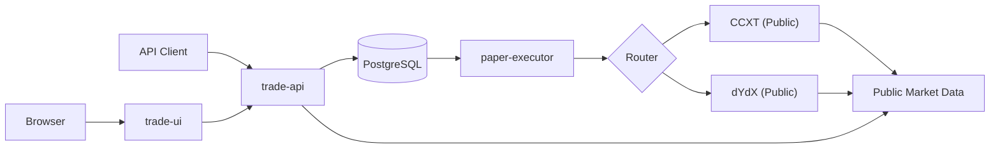

# システム設計

公開市場データを参照して約定シミュレーションを行うPaper取引基盤のシステム設計です。実取引所への発注や認証情報の保持は行いません。

## 仕様の所在

| 関心事 | 正本 |
|---|---|
| REST APIの入力、応答、エラー、履歴検索 | [API仕様](api.md) |
| 注文状態遷移、再試行、リスク・約定・評価計算 | [取引・執行仕様](trading-engine.md) |
| DBの不変条件、マイグレーション、バックアップ | [DB運用手順](database.md) |
| 起動、設定、監視、障害時の操作 | [Quickstart & 操作ガイド](quickstart.md) |
| Gate対応時の判断と実装記録 | [移行・実装履歴](archive/README.md) |

## 1. 全体構成

| サービス | 役割 | 公開ポート |
|---|---|---|
| `trade-api` | 注文受付、取消・全決済、照会、取引制御（Close-only / Kill Switch）、銘柄メタデータ・リアルタイム価格・口座残高のオンデマンド提供 | `127.0.0.1:8000` |
| `trade-ui` | 手動注文、ポジション全決済、注文取消、状態確認（`trade-api` へのリバースプロキシ）。※Bot稼働中は手動発注を行わず、緊急時の確認・全決済用として運用 | `127.0.0.1:8080` |
| `paper-executor` | 公開注文板取得、リスク検査、約定処理、ポジション・損益更新 | 非公開 |
| `postgres` | 注文、約定、ポジション、損益、制御状態の永続化 | 非公開 |
| `db-migrate` | 起動時スキーママイグレーション | 非公開 |
| `db-backup` | DBダンプ作成（`tools` プロファイル） | 非公開 |
| `db-restore` | 隔離環境でのリストア検証（`restore` プロファイル） | 非公開 |

## 2. セキュリティ & 配置方針

- **ネットワーク隔離**: ホストへ公開するのは `trade-api` と `trade-ui` のみ（`127.0.0.1` バインド）。`postgres` と `paper-executor` は内部ネットワーク内でのみ通信。
- **認証**: `trade-api` は Bearer トークン認証を要求。`trade-ui` はブラウザにトークンを露出せず、サーバーサイドで中継。
- **秘密情報**: DBパスワードとAPIトークンのみを `TRADE_SECRETS_DIR` から読み取り専用マウント。取引所のAPIキーや秘密鍵は一切使用・保持しない。
- **コンテナ権限**: 非rootユーザー実行、read-only root filesystem、ケーパビリティ制限。
- **運用分離**: 単一スタック（`compose.yaml`）で Bot 専用運用とし、手動UIは緊急用として分離。

## 3. データモデル

PostgreSQL を注文ワークキューおよび状態管理として利用します。

| テーブル | 用途 | 主キー / 一意キー / インデックス |
|---|---|---|
| `orders` | 注文要求と執行状態（監査用 `strategy_id` 含む） | `id` (PK), `request_id` (Unique), `strategy_id` (Index) |
| `fills` | 約定履歴 | `id` (PK), `(order_id, sequence)` (Unique), `order_id` (Index) |
| `positions` | 取引所・銘柄ごとのポジション | `id` (PK), `(exchange_id, symbol)` (Unique) |
| `daily_pnl` | UTC日単位の確定損益 | `id` (PK), `trade_date` (Unique) |
| `control_flags` | Close-only / Kill Switch 状態 | `id` (PK, `1`固定) |
| `service_heartbeats` | サービス生存監視 | `service` (PK) |
| `schema_migrations` | マイグレーション履歴 | `version` (PK) |

- 金額・数量・損益・手数料はすべて `NUMERIC`（Decimal）、日時はすべて `TIMESTAMPTZ`（UTC）。
- `paper-executor` は `FOR UPDATE SKIP LOCKED` で注文を取得し、多重実行を防止。
- 外部市場データ（銘柄メタデータ）や仮想口座残高のためのテーブル新設は行わず、オンデマンド算出とインメモリキャッシュで対応します。

## 4. 取引所アダプター

公開市場データの取得と正規化を `trade_common.exchange_adapters` で抽象化。

- 共通契約は`resolve_symbol`、ネットワークアクセスを行わない`resolve_cached_symbol`、`fetch_instruments`、`fetch_prices`、`fetch_order_book`です。CCXT系とdYdXの両アダプターが同じ契約を実装します。
- **CCXT**: 設定された取引所（Binance, Bybit 等）の公開APIを利用（認証不要）。
  - 取引所固有オプション（`options: {"defaultType": "linear"}` 等）の伝達機構を配備し、Bybit USDT無期限契約等のデリバティブ銘柄に対応。
  - シンボル表記の透過的正規化層により、呼出元の Bybit ネイティブ表記（`BTCUSDT`）と CCXT 統一表記（`BTC/USDT:USDT`）を相互に自動解決。
- **dYdX**: Mainnet Indexer の REST API を利用（ノード・署名不要）。
- 設定ファイル（`settings.json`）の `exchanges` に定義された取引所・銘柄のみを処理。
- 設定symbolをcanonicalとしてDBとAPI応答へ統一し、取引所market IDとunified symbolの完全一致だけをcase-sensitiveなaliasとして許可。衝突設定はfail closed。
- metadata cacheは1時間TTL・最大24時間stale-if-error、価格cacheは1秒TTL・stale禁止。共有poolとsingle-flight lockによりAPIの並行missを集約。
- 価格の`observed_at`は取引所が返す注文板timestampを優先し、存在しない場合だけ受信時刻を使用します。鮮度判定も同じ時刻を基準にします。
- readinessはDBとBybit metadataだけを集約し、他取引所障害は該当APIへ隔離。
- 注文・約定履歴のsymbol検索はDBだけで完結します。現行設定にない取引所・symbolも入力表記で検索でき、既存アダプターのalias cacheは利用しても、アダプター生成や外部metadata更新は行いません。

## 5. 設計判断（Architecture Decisions）

### 注文ワークキューへの PostgreSQL 採用
外部メッセージブローカー（Redis や RabbitMQ 等）を使わず、PostgreSQL を注文キューおよび状態ストアとして兼用しています。

- **採用理由**:
  - 注文要求・約定結果・ポジション・損益・取引制御フラグを単一の RDBMS でトランザクショナルに整合性を保つため。
  - コンテナ構成を最小化し、ローカル運用の保守コストを下げるため。
  - `FOR UPDATE SKIP LOCKED` により、複数ワーカー時でもロック競合なしに安全なキューイングが可能であるため。
- **トレードオフと対策**:
  - DB マイグレーション・バックアップ・リストア運用の責務が生じる（`db-migrate`, `db-backup`, `db-restore` で自動化・手順化）。
  - ワーカーが異常停止した場合に注文が `processing` のまま滞留するリスクがある（30秒以上更新のない注文を再取得対象とするタイムアウト機構を配備）。

### ステートレス＆オンデマンド設計の堅持
銘柄メタデータ照会（`/instruments`）、リアルタイム価格照会（`/prices`）、口座残高照会（`/balance`）の実装にあたり、専用の DB テーブル（`instruments`, `accounts`）や価格を常時収集するバックグラウンドポーリングは設けていません。一方、Gate対象のBybit metadataだけは`trade-api`のlifespan taskが起動時にwarm-upし、正常時は1時間ごと、失敗時は1、2、4、8、16、32、60秒（以後60秒）で更新を再試行します。このタスクは永続データを持たず、readinessとインメモリcacheの維持だけを担います。

- **採用理由**:
  - Trade Container の設計思想（ステートレスで軽量・堅牢なコンテナ基盤）を維持し、過剰設計を避けるため。
  - CCXT メタデータのインメモリキャッシュ（1時間 TTL）および価格のオンデマンド取得（1秒 TTL キャッシュ）でレートリミットを保護しつつ最新市場データを取得可能。
  - 残高は静的設定（`initial_balance`）と確定/未実現損益から決定論的にオンデマンド算出でき、状態の二重管理による不整合リスクを排除できるため。

### 単一スタック運用と監査タグによる分離
複合キー導入による DB 完全マルチテナント化は見送り、単一の Docker Compose スタックを Bot 専用として運用し、注文追跡用として `orders` テーブルに NULL 許容の `strategy_id` カラムを追加しました。

- **採用理由**:
  - Bot 本番稼働時の予期せぬ競合（手動操作との意図しないポジション合算等）を根本から排除するため。
  - 手動 UI は緊急時の確認および手動全決済専用とし、注文の所属追跡は `strategy_id` で監査可能とすることで、最小限のスキーマ変更で安全性と追跡性を両立。

## 6. 障害境界とログ

- `422`は不正な入力、許可されていない取引所・symbol、または確定した制約違反です。`503`はmetadata、価格、DB、評価材料など必須依存情報の一時的な不足です。`409`は冪等性キーや取引制御状態との競合です。
- API受付済み注文について、Executorでmetadataまたは注文板を一時取得できない場合は終端Rejectにせず、DBの`retry_count`と`next_attempt_at`で再試行します。設定から削除された取引所・symbolや、取得済みmetadataで確定した制約違反は終端Rejectです。
- `trade-api`と`paper-executor`はUTC timestamp、level、logger、message、例外情報を持つJSON Linesを標準出力と日次ローテーションファイルへ出力します。注文処理のmessageには必要に応じて`order_id`、`exchange`、`symbol`を含め、履歴検索失敗時にも外部接続を誘発しません。
