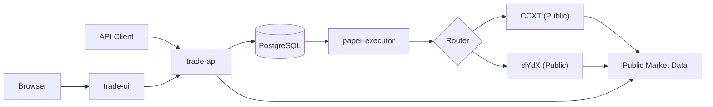

# システム設計

公開市場データを参照して約定シミュレーションを行うPaper取引基盤のシステム設計です。実取引所への発注や認証情報の保持は行いません。

## 仕様の所在

| 関心事 | 正本 |
|---|---|
| REST APIの入力、応答、エラー、履歴検索 | [API仕様](api.md) |
| Bybit 設定外銘柄への対応の概要・受入条件 | [Bybit 動的銘柄対応](bybit-dynamic-symbols.md) |
| 注文状態遷移、再試行、リスク・約定・評価計算 | [取引・執行仕様](trading-engine.md) |
| DBの不変条件、マイグレーション、バックアップ | [DB運用手順](database.md) |
| 起動、設定、監視、障害時の操作 | [Quickstart & 操作ガイド](quickstart.md) |

## 1. 全体構成

```mermaid
flowchart LR
    C["API Client"] --> A["trade-api"]
    U["Browser"] --> W["trade-ui"] --> A
    A --> D[(PostgreSQL)]
    D --> P["paper-executor"]
    P --> R{"Router"}
    R --> C1["CCXT (Public)"]
    R --> C2["dYdX (Public)"]
    C1 --> X["Public Market Data"]
    C2 --> X
    A --> X
```

| サービス | 役割 | 公開ポート |
|---|---|---|
| `trade-api` | 注文受付、取消・全決済、照会、取引制御（Close-only / Kill Switch）、銘柄メタデータ・リアルタイム価格・口座残高のオンデマンド提供 | `127.0.0.1:8000` |
| `trade-ui` | 手動注文、ポジション全決済、注文取消、状態確認（`trade-api` へのリバースプロキシ）。※Bot稼働中は手動発注を行わず、緊急時の確認・全決済用として運用 | `127.0.0.1:8080` |
| `paper-executor` | 公開注文板取得、リスク検査、約定処理、ポジション・損益更新 | 非公開 |
| `postgres` | 注文、約定、ポジション、損益、制御状態の永続化 | 非公開 |
| `db-migrate` | 起動時スキーママイグレーション | 非公開 |
| `db-backup` | DBダンプ作成（`tools` プロファイル） | 非公開 |
| `db-restore` | 隔離環境でのリストア検証（`restore` プロファイル） | 非公開 |

## 2. セキュリティ & 配置方針

- **ネットワーク隔離**: ホストへ公開するのは `trade-api` と `trade-ui` のみ（`127.0.0.1` バインド）。`postgres` と `paper-executor` は内部ネットワーク内でのみ通信。
- **認証**: `trade-api` は Bearer トークン認証を要求。`trade-ui` はブラウザにトークンを露出せず、サーバーサイドで中継。
- **秘密情報**: DBパスワードとAPIトークンのみを `TRADE_SECRETS_DIR` から読み取り専用マウント。取引所のAPIキーや秘密鍵は一切使用・保持しない。
- **コンテナ権限**: 非rootユーザー実行、read-only root filesystem、ケーパビリティ制限。
- **運用分離**: 単一スタック（`compose.yaml`）で Bot 専用運用とし、手動UIは緊急用として分離。

## 3. データモデル

PostgreSQL を注文ワークキューおよび状態管理として利用します。

| テーブル | 用途 | 主キー / 一意キー / インデックス |
|---|---|---|
| `orders` | 注文要求と執行状態（監査用 `strategy_id` 含む） | `id` (PK), `request_id` (Unique), `strategy_id` (Index) |
| `request_keys` | 通常注文・全決済子注文・全決済親処理に共通する冪等性キーの名前空間 | `request_id` (PK), 操作種別・対象ID |
| `close_requests` / `close_request_positions` | 全決済の親処理、受付時の対象建玉、銘柄ごとの進捗・残数量 | `id` (PK), 親 `request_id` (Unique), 対象建玉 (Unique within parent) |
| `fills` | 約定履歴 | `id` (PK), `(order_id, sequence)` (Unique), `order_id` (Index) |
| `positions` | 取引所・銘柄ごとのポジション | `id` (PK), `(exchange_id, symbol)` (Unique) |
| `daily_pnl` | UTC日単位の確定損益 | `id` (PK), `trade_date` (Unique) |
| `control_flags` | Close-only / Kill Switch 状態 | `id` (PK, `1`固定) |
| `service_heartbeats` | サービス生存監視 | `service` (PK) |
| `schema_migrations` | マイグレーション履歴 | `version` (PK) |

- 金額・数量・損益・手数料はすべて `NUMERIC`（Decimal）、日時はすべて `TIMESTAMPTZ`（UTC）。
- `paper-executor` は `FOR UPDATE SKIP LOCKED` で注文を取得します。同一建玉の全決済子注文は順序付け、約定記録と同じトランザクションで建玉・取消・Kill Switch を再確認して反転や取消後の約定を防ぎます。
- 外部市場データ（銘柄メタデータ）や仮想口座残高のためのテーブル新設は行わず、オンデマンド算出とインメモリキャッシュで対応します。

## 4. 取引所アダプター

公開市場データの取得と正規化を `trade_common.exchange_adapters` で抽象化。

- 共通契約は`resolve_symbol`、ネットワークアクセスを行わない`resolve_cached_symbol`、`fetch_instruments`、`fetch_prices`、`fetch_order_book`です。CCXT系とdYdXの両アダプターが同じ契約を実装します。
- **CCXT**: 設定された取引所（Binance, Bybit 等）の公開APIを利用（認証不要）。
  - 取引所固有オプション（`options: {"defaultType": "linear"}` 等）の伝達機構を配備し、Bybit USDT無期限契約等のデリバティブ銘柄に対応。
  - シンボル表記の透過的正規化層により、呼出元の Bybit ネイティブ表記（`BTCUSDT`）と CCXT 統一表記（`BTC/USDT:USDT`）を相互に自動解決。
- **dYdX**: Mainnet Indexer の REST API を利用（ノード・署名不要）。
- `settings.json` に定義された取引所だけを処理します。Bybit は市場metadataで USDT 建て・USDT 決済の linear swap と確認できれば、設定外銘柄も明示指定できます。他取引所は設定済み銘柄を対象とします。
- Bybit の市場 ID（`BTCUSDT` 形式）をcanonicalとしてDBとAPI応答へ統一します。unified symbol（`BTC/USDT:USDT` 形式）はcase-sensitiveなaliasとして解決します。銘柄省略時の市場情報APIと`/exchanges`は設定済み銘柄を返します。
- Bybit metadataのTTLは設定可能な300秒（既定値）です。有効期限内だけ再利用し、期限切れ後の更新失敗時に古い値へフォールバックしません。Mark Priceは照会ごとに取得し、古い価格を代用しません。並行したmetadata更新は共有poolとsingle-flight lockで集約します。
- 価格の`mark_observed_at`はMark Priceを取得したUTC時刻です。板由来の`observed_at`は取引所の注文板timestampを優先し、存在しない場合は受信時刻を使います。Bybit の価格照会ではMark Priceが必須で、注文板が欠けた場合の板由来フィールドはnullを許容します。
- readinessはDBと有効期限内のBybit metadata取得を集約します。取得済みmetadataで特定銘柄の制約だけが不正な場合はサービス全体を停止せず、その銘柄の注文で判定します。他取引所障害も該当APIへ隔離します。
- 注文・約定履歴のsymbol検索はDBだけで完結します。照会時の設定にない取引所・symbolも検索でき、Bybit の一意に変換できるaliasは外部通信なしでcanonical化します。アダプター生成や外部metadata更新は行いません。

## 5. 設計判断（Architecture Decisions）

### 注文ワークキューへの PostgreSQL 採用
外部メッセージブローカー（Redis や RabbitMQ 等）を使わず、PostgreSQL を注文キューおよび状態ストアとして兼用しています。

- **採用理由**:
  - 注文要求・約定結果・ポジション・損益・取引制御フラグを単一の RDBMS でトランザクショナルに整合性を保つため。
  - コンテナ構成を最小化し、ローカル運用の保守コストを下げるため。
  - `FOR UPDATE SKIP LOCKED` により、複数ワーカー時でもロック競合なしに安全なキューイングが可能であるため。
- **トレードオフと対策**:
  - DB マイグレーション・バックアップ・リストア運用の責務が生じる（`db-migrate`, `db-backup`, `db-restore` で自動化・手順化）。
  - ワーカーが異常停止した場合に注文が `processing` のまま滞留するリスクがある（30秒以上更新のない注文を再取得対象とするタイムアウト機構を配備）。

### ステートレス＆オンデマンド設計の堅持
銘柄メタデータ照会（`/instruments`）、リアルタイム価格照会（`/prices`）、口座残高照会（`/balance`）のための専用DBテーブル（`instruments`, `accounts`）や価格の常時収集は設けません。全決済の親処理と子注文の対応は永続化します。Bybit metadataは`trade-api`のlifespan taskが起動時にwarm-upし、設定可能な300秒のTTL内で更新します。更新に失敗して有効期限が切れた場合は該当リクエストとreadinessを503とし、期限切れデータを使用しません。

- **採用理由**:
  - Trade Container の設計思想（ステートレスで軽量・堅牢なコンテナ基盤）を維持し、過剰設計を避けるため。
  - CCXT メタデータを有効期限内だけインメモリで再利用し、Mark Priceは照会ごとに取得することで、市場データの鮮度を明確にするため。
  - 残高は静的設定（`initial_balance`）と確定/未実現損益から決定論的にオンデマンド算出でき、状態の二重管理による不整合リスクを排除できるため。

### 単一スタック運用と監査タグによる分離
複合キー導入による DB 完全マルチテナント化は見送り、単一の Docker Compose スタックを Bot 専用として運用し、注文追跡用として `orders` テーブルに NULL 許容の `strategy_id` カラムを追加しました。

- **採用理由**:
  - Bot 本番稼働時の予期せぬ競合（手動操作との意図しないポジション合算等）を根本から排除するため。
  - 手動 UI は緊急時の確認および手動全決済専用とし、注文の所属追跡は `strategy_id` で監査可能とすることで、最小限のスキーマ変更で安全性と追跡性を両立。

## 6. 障害境界とログ

- `422`は不正な入力、未知銘柄、対象外市場、取引不能、または確定した制約違反です。`503`はmetadata、Mark Price、注文板、DB、評価材料など必須依存情報の不足です。取得済みmetadataの必須制約が欠落・不正な場合も、利用者の制約違反ではなく`503`（`instrument_metadata_invalid`）です。Bybit の銘柄関連エラーには`reason_code`を付けます。`409`は冪等性キーや取引制御状態との競合です。
- 注文APIの受付時に必要な市場情報を取得できない場合は、注文を作らず503を返します。API受付済み注文について、Executorでmetadataまたは注文板を一時取得できない場合や、検査に使う必須制約が不正な場合は終端Rejectにせず、DBの`retry_count`と`next_attempt_at`で再試行します。対象外市場・確定した数量制約違反の新規・増加注文は終端Rejectです。全決済の制約免除条件は[取引・執行仕様](trading-engine.md)に従います。
- `trade-api`と`paper-executor`はUTC timestamp、level、logger、message、例外情報を持つJSON Linesを標準出力と日次ローテーションファイルへ出力します。注文処理のmessageには必要に応じて`order_id`、`exchange`、`symbol`を含め、履歴検索失敗時にも外部接続を誘発しません。
