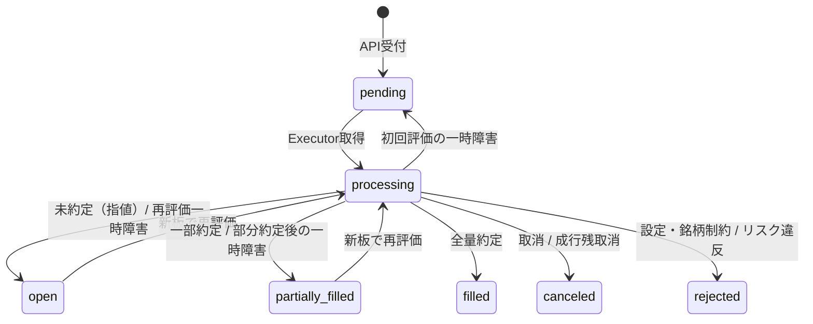

# 取引・執行仕様

`paper-executor` による注文板の取得、リスク検査、約定処理、ポジションおよび損益の計算仕様です。

## 1. 注文状態遷移

- **処理対象**: `pending`, `open`, `partially_filled`
- **タイムアウト**: `processing` のまま 30 秒以上更新がない注文は再取得対象。
- **取消要求**: 終端状態以外の注文に `cancellation_requested=true` がセットされた場合、次回評価時に `canceled` へ移行。
- **一時障害**: metadataまたは注文板の取得失敗・空応答・鮮度違反では、約定済み数量と`pending` / `open` / `partially_filled`の意味を維持して再試行。理由は`rejection_reason`、回数は`retry_count`、次回時刻は`next_attempt_at`へ記録。
- **終端Reject**: 設定から削除された取引所・symbol、取得できたmetadataの必須制約不足・不正・inactive、または確定したリスク違反だけを`rejected`とする。

## 2. リスク検査 & 取引制御

`paper-executor` は約定処理の直前に以下の全項目を検査します。必要なmetadataと注文板を取得でき、違反が確定した注文は`rejected`となり、理由は`rejection_reason`に記録されます。一時的に検査材料を取得できない場合はRejectせず、前節の規則で延期します。

| 検査項目 | 条件 |
|---|---|
| **許可銘柄** | `settings.json` の `exchanges[exchange_id].symbols` に含まれる |
| **数量上限** | `0 < quantity <= max_order_quantity` |
| **銘柄別最小数量** | `quantity >= instrument.min_qty` |
| **銘柄別刻み幅** | `(quantity - min_qty) % qty_step == 0` |
| **銘柄別最小金額** | `quantity * price >= instrument.min_notional`（※市場メタデータに定義されている場合のみ適用。Limit注文: `limit_price`、Market注文: 買い最良Ask / 売り最良Bid） |
| **Kill Switch** | 無効であること |
| **Close-only** | 有効時は `reduce_only=true` であること |
| **注文金額上限** | `notional <= max_order_notional` |
| **指値乖離** | 現在価格からの乖離が `max_price_deviation_pct` 以内 |
| **注文頻度** | 直近1分間の注文数が `max_orders_per_minute` 以下 |
| **ポジション金額** | 約定後の想定ポジション金額が `max_position_notional` 以下 |
| **日次損失** | 当日実現損失が `max_daily_loss` 未満 |
| **Reduce-only** | 既存ポジションを増加・反転させない |

> **特例ルール**:
> 1. **Close-only 特例**: Close-only 時の有効な Reduce-only 注文は、ポジション解消を最優先するため上限検査（数量・金額・頻度・日次損失）をスキップします（銘柄・正の数量・乖離・反転禁止・鮮度検査は継続）。
> 2. **全決済時の Reduce-only 特例**: `reduce_only=true` かつ「既存ポジション全量を決済する注文」については、端数（dust）が残ってポジション解消が不能になる事態を防ぐため、`qty_step`、`min_notional`、`min_qty` の制約を免除し、ポジション解消を最優先します。

## 3. 約定ロジック

### 市場データの取得と判定
- 注文ごとに `exchange_id` に応じた公開注文板（買い: Ask / 売り: Bid）を取得（Bybit 等の表記揺れはアダプターが自動正規化）。
- データ経過時間が `market_data_max_age_seconds` を超える場合や板が空の場合は次回ループへ延期（指数バックオフ: 2s -> 4s -> ... -> 最大60s）。

### 成行注文（Market）
- 最良気配から価格優先で数量を消費。
- **全量消費**: `filled`（Taker 手数料適用）。
- **板枯渇（部分約定）**: 約定分を記録し、未約定残数量を取り消して `canceled`。
- **板なし**: 一時的な市場データ不足として約定せず延期。取消要求が入るまで指数バックオフで再試行。

### 指値注文（Limit）
- **買い**: 最良 Ask <= 指値 / **売り**: 最良 Bid >= 指値 で約定。
- 初回評価で即座に市場性があれば Taker 約定。
- 市場性がなければ `open`（`resting_since` 記録）。次回以降の板更新で約定した場合は Maker 約定。
- 部分約定時は残数量のみを未約定（`partially_filled`）として維持。

## 4. ポジション & 損益計算

約定（`fills`）発生時に `(exchange_id, symbol)` 単位のポジション（`positions`）を更新します（買い: 正、売り: 負）。

- **同方向の追加**: 数量加重平均で `average_entry_price` を更新。
- **反対方向の約定（決済）**:
  $$\text{実現損益} = \text{決済数量} \times (\text{約定価格} - \text{平均取得価格}) \times \text{方向} - \text{手数料}$$
- **ポジション反転**: 決済分で損益確定後、残余数量の取得価格を当該約定価格に設定。
- **日次損益**: UTC 基準で `daily_pnl` に集計。
- **未実現損益（照会時）**:
  $$\text{未実現損益} = \text{数量} \times (\text{現在価格} - \text{平均取得価格})$$
  ※現在価格は照会時の公開板仲値から取得（DBには非保存）。

## 5. 口座残高・余力計算

`GET /api/v1/balance` 照会時に、設定値およびデータベースの約定・損益記録から決定論的にオンデマンド算出します。

- **確定損益合計（手数料控除済）**:
  $$\text{Realized PnL} = \sum(\text{daily\_pnl.realized\_pnl})$$
- **手数料累計（監査・表示用内訳）**:
  $$\text{Total Fee} = \sum(\text{fills.fee})$$
- **未実現損益合計**:
  $$\text{Unrealized PnL} = \sum(\text{position.quantity} \times (\text{current\_mid\_price} - \text{position.average\_entry\_price}))$$
- **純資産（Equity）**:
  $$\text{Equity} = \text{initial\_balance} + \text{Realized PnL} + \text{Unrealized PnL}$$
- **使用証拠金（Used Margin）**:
  $$\text{Used Margin} = \sum\left(\frac{|\text{position.quantity}| \times \text{current\_mid\_price}}{\text{default\_leverage}}\right)$$
- **有効残高（Available Balance）**:
  $$\text{Available Balance} = \max(0, \text{Equity} - \text{Used Margin})$$

Paper環境ではUSD・USDC・USDTだけを1:1換算します。その他の決済通貨または価格取得不能positionを検出した場合、推測値を返さず残高照会を503にします。

## 6. 銘柄別数量制約

- 最小数量: `quantity >= min_qty`
- step: Decimalで `(quantity - min_qty) % qty_step == 0`
- 最小notional: 市場メタデータに定義されている場合のみ検査。Limitは指値、API Marketはfresh mid、Executor Marketはbuy ask / sell bidを使用
- 新しい注文のAPI受付時にmetadataを取得できなければ503でfail closed。ただし、既存`request_id`の同内容再送はmetadata検査より先に照合され、同じcanonical symbolと`strategy_id`であれば200で既存注文を返す。Market価格だけが取得不能な場合に限り、APIはnotional判定をExecutorへ委任
- Executorでmetadataまたは注文板の取得が例外・空応答・鮮度違反になった場合は執行せず、2秒から最大60秒までの指数バックオフで取消まで再試行。部分約定済み注文は状態と約定数量を維持
- metadata取得成功後に必須制約（`min_qty`, `qty_step`）が欠ける場合、値が不正な場合、inactiveの場合、または数量制約違反の場合は終端Reject。設定から取引所またはsymbolが削除された注文も終端Reject
- Reduce-onlyで現在position全量と数量が完全一致する場合、`min_qty`・`qty_step`・`min_notional`を免除
