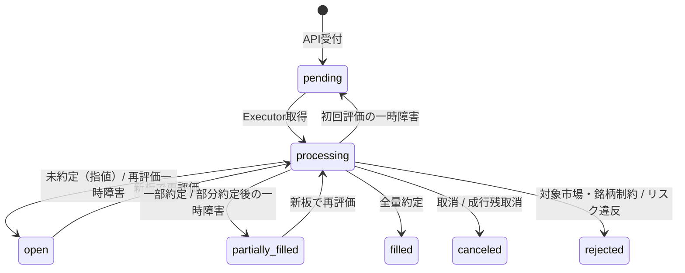

# 取引・執行仕様

`paper-executor` による注文板の取得、リスク検査、約定処理、ポジションおよび損益の計算仕様です。

この文書は執行・リスク・評価規則の正本です。対象市場とcanonical symbolの保存規則は[DB運用手順](database.md)、機能の概要は[Bybit 動的銘柄対応](bybit-dynamic-symbols.md)を参照してください。

## 1. 注文状態遷移

```mermaid
stateDiagram-v2
    [*] --> pending: API受付
    pending --> processing: Executor取得
    open --> processing: 新板で再評価
    partially_filled --> processing: 新板で再評価
    processing --> open: 未約定（指値）/ 再評価一時障害
    processing --> partially_filled: 一部約定 / 部分約定後の一時障害
    processing --> pending: 初回評価の一時障害
    processing --> filled: 全量約定
    processing --> canceled: 取消 / 成行残取消
    processing --> rejected: 対象市場・銘柄制約 / リスク違反
```

- **処理対象**: `pending`, `open`, `partially_filled`
- **タイムアウト**: `processing` のまま 30 秒以上更新がない注文は再取得対象。
- **取消要求**: 終端状態以外の注文に`cancellation_requested=true`がセットされた場合、未約定残量を`canceled`へ移行します。Kill Switchと、`inactive`/`unknown`へ変わった既存のReduce-only Limit注文も取消対象です。全決済の子注文を個別に取り消すと親も`canceling`になり、代替子の生成を止めます。
- **一時障害**: 必要なmetadata、注文板、Mark Priceの取得失敗・空応答・鮮度違反、および実際に検査する必須制約の欠落・不正では、約定済み数量と`pending` / `open` / `partially_filled`の意味を維持して再試行。理由は`rejection_reason`、回数は`retry_count`、次回時刻は`next_attempt_at`へ記録します。
- **`rejection_reason`の意味**: 非終端時は直近の再試行・待機理由、`rejected`や`canceled`では終端理由です。正常な再評価で一時理由をクリアし、`filled`では`null`にします。部分約定した成行の残量取消や手動取消の理由は監査用に保持します。
- **終端Reject**: 取得済みmetadataで対象外市場と確定した注文、新規・増加注文に対する`inactive`/`unknown`、正常な制約に対する確定違反を`rejected`とします。Bybit の設定外銘柄という理由だけでは拒否しません。受付済み全決済の対象市場が執行前に対象外と確定した場合は、その建玉の親処理を`failed`にします。

## 2. リスク検査 & 取引制御

`paper-executor` は約定処理の直前に以下の項目を検査します。取引中はmetadataと注文板、Bybit の`inactive`/`unknown`対象市場の縮小・決済ではmetadataとMark Priceを使います。Kill Switchと取消要求は市場情報の取得より先に検査し、約定保存時にも再確認します。市場・数量・価格に対する違反が確定した注文は`rejected`となり、理由は`rejection_reason`に記録されます。Kill Switchや取消要求では`canceled`へ進めます。一時的に検査材料を取得できない場合はRejectせず、前節の規則で延期します。

| 検査項目 | 条件 |
|---|---|
| **対象銘柄** | Bybit は metadata で USDT 建て・USDT 決済の Linear Perpetual と確認できること。新規・増加注文は`active`であること。他取引所は設定済み銘柄であること |
| **数量上限** | `0 < quantity <= max_order_quantity` |
| **銘柄別最小数量** | `quantity >= instrument.min_qty` |
| **銘柄別刻み幅** | `(quantity - min_qty) % qty_step == 0` |
| **銘柄別最小金額** | `quantity * price >= instrument.min_notional`（正の値として定義されている場合のみ。Limitは指値、通常のMarketは買い最良Ask / 売り最良Bid、Bybit停止・状態不明市場のReduce-only MarketはMark Price） |
| **市場数量上限** | Bybit Marketは正の`max_market_qty`が必須。各子注文は`max_market_qty`以下、`max_qty`が定義されていればその値以下 |
| **Kill Switch** | 有効化時に新規受付を409で拒否し、受付済み注文を取消する。Executorは約定を記録しない |
| **Close-only** | 有効化時に非Reduce-only未完了注文を取消し、新規・増加注文の受付を拒否する |
| **注文金額上限** | `remaining_quantity × price <= max_order_notional`。Limitは指値、通常のMarketは買い最良Ask / 売り最良Bid、Bybit停止・状態不明市場のReduce-only MarketはMark Price |
| **指値乖離** | `abs(limit_price - fresh_mid) / fresh_mid <= max_price_deviation_pct` |
| **注文頻度** | 直近1分間の注文数が `max_orders_per_minute` 以下 |
| **ポジション金額** | `abs(現在数量 + 売買符号付き未約定数量) × valuation_price <= max_position_notional`。Bybitの`valuation_price`は新しいMark Price、他取引所は新しい板仲値 |
| **日次損失** | 当日実現損失が `max_daily_loss` 未満 |
| **Reduce-only** | 既存ポジションを増加・反転させない |

> **特例ルール**:
> 1. **Close-only 特例**: Close-only 時の有効なReduce-only注文は、ポジション解消を優先するため内部の数量・注文金額・想定ポジション金額・頻度・日次損失上限をスキップします。対象市場、正の数量、指値乖離、反転禁止、市場数量上限、必要データの鮮度検査は継続します。
> 2. **直接注文の全量決済特例**: `POST /orders`のReduce-only注文が現在建玉の全量と一致するときは、`min_qty`、`qty_step`、`min_notional`を、値の欠落・不正時も含めて免除します。部分決済には適用しません。Bybit Marketの`max_market_qty`と定義済み`max_qty`は免除せず、超過時は単一注文を拒否して全決済APIの利用を促します。
> 3. **全決済親処理の特例**: [全決済API](api.md)が生成した親に属する**すべての子注文**は、現在建玉の全量と個々の数量が一致しなくても`min_qty`、`qty_step`、`min_notional`を免除します。内部の数量・金額・頻度・日次損失・想定ポジション金額上限も免除します。市場の`max_market_qty`と定義済み`max_qty`、正の数量、反転禁止、必要データの取得・鮮度は維持します。
> 4. **取引停止後の建玉**: Bybitの対象市場が`inactive`または`unknown`でも、既存建玉のReduce-only Market縮小・決済を新しいMark Priceで認めます。Limitの新規受付は拒否し、受付済みLimitは取消します。新規・増加注文は認めません。

## 3. 約定ロジック

### 市場データの取得と判定
- 注文ごとに `exchange_id` に応じた公開注文板（買い: Ask / 売り: Bid）を取得（Bybit 等の表記揺れはアダプターが自動正規化）。
- データ経過時間が `market_data_max_age_seconds` を超える場合や板が空の場合は次回ループへ延期（指数バックオフ: 2s -> 4s -> ... -> 最大60s）。
- Bybit の`inactive`/`unknown`対象市場のReduce-only Market縮小・決済では、Mark Priceを取得できれば板がなくてもその価格でPaper約定させます。Mark Priceを取得できなければ建玉を保持して再試行します。

### 成行注文（Market）
- 最良気配から価格優先で数量を消費。
- **全量消費**: `filled`（Taker 手数料適用）。
- **板枯渇（部分約定）**: 約定分を記録し、当該注文の未約定残数量を`canceled`にします。全決済親処理に属する場合は現在建玉から残数量を再計算し、同じ親へ代替子注文を追加します。
- **板なし**: 取引中の注文は市場データ不足として約定せず延期します。全決済親処理は`waiting`で指数バックオフし、固定回数による終了はしません。
- **Bybitの停止・状態不明市場**: 既存建玉のReduce-only Marketは、新しいMark Priceで注文の全量をPaper約定させ、Taker手数料を適用します。注文板の深さやMaker判定は使いません。

### 指値注文（Limit）
- **買い**: 最良 Ask <= 指値 / **売り**: 最良 Bid >= 指値 で約定。
- 初回評価で即座に市場性があれば Taker 約定。
- 市場性がなければ `open`（`resting_since` 記録）。次回以降の板更新で約定した場合は Maker 約定。
- 部分約定時は残数量のみを未約定（`partially_filled`）として維持。
- Bybitの対象市場が`inactive`/`unknown`になった場合、新しいReduce-only Limitは受け付けず、既存の未完了Reduce-only Limitは`canceled`にします。板がない状態でMark Priceと指値を比較して約定させません。

### 全決済親処理の執行

- APIは対象建玉をロックし、受付時の数量を正の`max_market_qty`と、定義済み`max_qty`の小さい方以下に分割して初期子注文を全件作成します。子の数量の合計は受付時の建玉の絶対値に一致し、端数を捨てません。個々の子は親への所属で最小制約免除を判定します。
- 同一建玉の子注文は連番順に1件ずつ処理します。異なる建玉は独立して進め、一つが価格不足で`waiting`になっても他の銘柄を停止しません。子注文と親・対象建玉の対応はDBに保存します。
- 子注文が約定に使用した注文板スナップショットの表示流動性を、同じ建玉の次の子注文に再利用しません。次の子は新しい注文板スナップショットが得られるまで待機します。
- 子の執行直前と約定保存時に、同じDBトランザクションで現在建玉、Reduce-onlyの方向・残量、親・子の取消状態、Kill Switchを再検査します。残建玉を超える約定は記録せず、不要な子を取り消して新しい数量の子を追加します。複数Executorが動いても建玉を反転させません。
- 子注文が部分約定した後の残量は元の子では取り消し、現在建玉から同じ親の代替子を計画します。受付済み子の数量は変更せず、取消済みの子も親の監査履歴に残します。市場データが更新されず約定できない場合は親を`waiting`にして取消まで再試行します。
- 親の手動取消、子の個別取消、Kill Switchでは親を`canceling`にし、新しい子を生成しません。取消受付後の新規約定を防ぎ、全子注文が終端になってから親を`canceled`にします。対象市場ではないと確定した建玉は残る子を取り消してその対象を`failed`とし、他の建玉の処理は続けます。

## 4. ポジション & 損益計算

約定（`fills`）発生時に `(exchange_id, symbol)` 単位のポジション（`positions`）を更新します（買い: 正、売り: 負）。

- **同方向の追加**: 数量加重平均で `average_entry_price` を更新。
- **反対方向の約定（決済）**:
  $$\text{実現損益} = \text{決済数量} \times (\text{約定価格} - \text{平均取得価格}) \times \text{方向} - \text{手数料}$$
- **ポジション反転**: 決済分で損益確定後、残余数量の取得価格を当該約定価格に設定。
- **日次損益**: 約定の`executed_at`をUTCに変換した日付へ、手数料控除後の確定損益を`daily_pnl`に集計します。後日記録した約定も約定日の値を更新します。新規建て時の手数料もその日に計上します。
- **未実現損益（照会時）**:
  $$\text{未実現損益} = \text{数量} \times (\text{現在価格} - \text{平均取得価格})$$
  ※Bybit の現在価格は照会時のMark Price、他取引所は公開板仲値を使用します（DBには非保存）。Bybit のMark Priceを取得できなくても保存済み建玉は返し、価格評価を`unavailable`とします。

## 5. 口座残高・余力計算

`GET /api/v1/balance` 照会時に、設定値およびデータベースの約定・損益記録から決定論的にオンデマンド算出します。

- **確定損益合計（手数料控除済）**:
  $$\text{Realized PnL} = \sum(\text{daily\_pnl.realized\_pnl})$$
- **手数料累計（監査・表示用内訳）**:
  $$\text{Total Fee} = \sum(\text{fills.fee})$$
- **未実現損益合計**:
  $$\text{Unrealized PnL} = \sum(\text{position.quantity} \times (\text{valuation\_price} - \text{position.average\_entry\_price}))$$
- **純資産（Equity）**:
  $$\text{Equity} = \text{initial\_balance} + \text{Realized PnL} + \text{Unrealized PnL}$$
- **使用証拠金（Used Margin）**:
  $$\text{Used Margin} = \sum\left(\frac{|\text{position.quantity}| \times \text{valuation\_price}}{\text{default\_leverage}}\right)$$
- **有効残高（Available Balance）**:
  $$\text{Available Balance} = \max(0, \text{Equity} - \text{Used Margin})$$

Paper環境ではUSD・USDC・USDTだけを1:1換算します。その他の決済通貨または価格取得不能positionを検出した場合、推測値を返さず残高照会を503にします。
`valuation_price`はBybitではMark Price、他取引所では公開板仲値です。Bybit の設定外建玉も個別にmetadataとMark Priceを取得して計算します。
`default_leverage`は設定ファイルのPaper口座共通値を全銘柄へ一律適用し、銘柄別のレバレッジ設定は使用しません。

## 6. 銘柄別数量制約

- 最小数量: `quantity >= min_qty`
- step: Decimalで `(quantity - min_qty) % qty_step == 0`
- 最小notional: `min_notional`が正の値として定義されている場合だけ検査。未定義は検査不要です。Limitは指値、API受付時の通常Marketは新しい板仲値、Executorの通常Marketは買い最良Ask / 売り最良Bidを使用します。Bybitの`inactive`/`unknown`対象市場に対する既存建玉のReduce-only Marketでは、API・Executorとも新しいMark Priceを使用します。
- Bybit Marketは正の`max_market_qty`を必須とし、定義済み`max_qty`も上限です。成行上限の欠落・不正または定義済み`max_qty`の不正では、`max_qty`を代用せず503またはExecutor再試行とします。
- 新規注文のAPI受付時に対象市場の判定、実際に使用する数量制約、必要な価格・注文板を取得できなければ、注文を作成せず理由コード付き503を返します。ただし既存`request_id`の同内容再送はmetadata検査より先に照合し、canonical symbol、`strategy_id`に加えて売買方向、種別、数量、価格、Reduce-onlyなど全注文内容が一致するときだけ200で既存注文を返します。
- Executorで必要なmetadata、注文板、Mark Priceが例外・空応答・鮮度違反になった場合や、実際に検査する必須制約が欠落・不正な場合は執行せず、2秒から最大60秒までの指数バックオフで取消まで再試行します。部分約定済み注文は状態と約定数量を維持します。
- metadata取得成功後に対象外市場、新規・増加注文に対する`inactive`/`unknown`、または正常な数量制約への違反が確定した場合は終端Rejectです。直接Reduce-only全量一致と全決済親処理の子では最小制約を値の欠落・不正時も含めて免除します。
